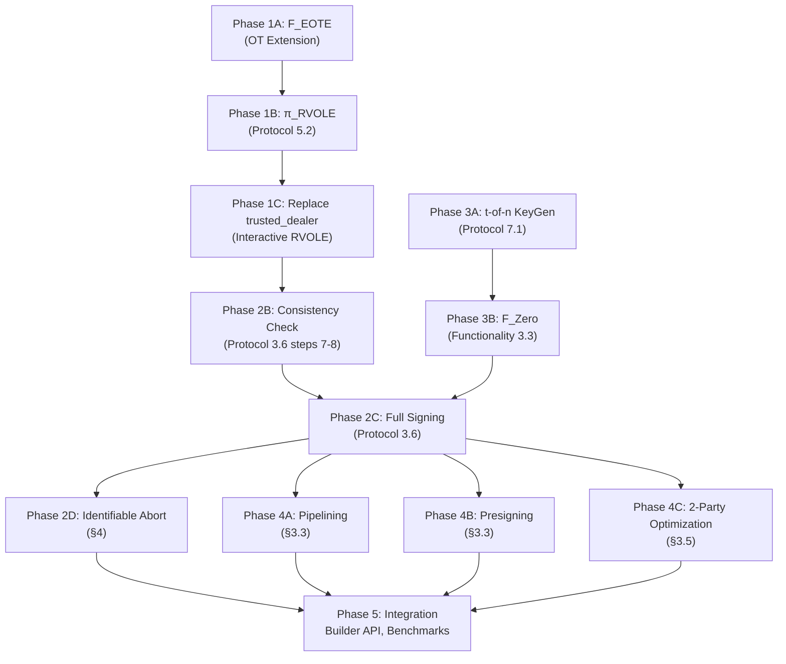

# DKLs23 Full Implementation Plan - LFX Mentorship Proposal

> **Mentorship:** LFDT - Implement DKLs23 (threshold ECDSA) protocol

> **Timeline:** Jun-Nov 2026 (Part-Time)

> **Paper:** Doerner, Kondi, Lee, shelat - *"Threshold ECDSA in Three Rounds"* ([ePrint 2023/765](https://eprint.iacr.org/2023/765))

> **Note:** This plan is my best-effort roadmap based on reading the DKLs23 paper and studying the existing `cggmp24` codebase. I built it before the mentorship starts because I wanted to understand the full scope of what I'd be working on. I expect this to evolve significantly with mentor guidance - there are parts of the protocol I don't deeply understand yet, and the implementation details will change as I learn. The goal here is to show I've engaged with the material and have a concrete starting point, not to claim I've figured everything out.

---

## Executive Summary

This plan transforms the DKLs23 paper into a production-grade Rust crate within the Lockness ecosystem. The paper defines four ideal functionalities and two main protocols. The implementation proceeds bottom-up: first the primitives (OT, RVOLE), then the protocols that compose them (Signing, KeyGen), and finally hardening (abort, presigning, benchmarks).

### Cross-Cutting Concern: Constant-Time Execution

Cryptographic implementations must resist side-channel attacks. All scalar operations involving secret values (`SecretScalar`, RVOLE shares, OT choice bits) will use constant-time primitives:

- **Scalar arithmetic:** `generic-ec`'s `SecretScalar` already wraps `zeroize`-protected values and delegates to constant-time implementations in the underlying curve crate (e.g., `k256` uses `subtle::CtOption` and `subtle::ConditionallySelectable` internally).
- **Branching on secrets:** All comparisons involving secret material will use the `subtle` crate's `ct_eq` / `ConstantTimeEq` instead of `==`. This is critical in the OT choice-bit handling (§5) and the RVOLE consistency check.
- **Polynomial evaluation:** The Horner's method evaluations in keygen (`evaluate_polynomial`) already process all coefficients unconditionally, but we will audit for any early-return paths.
- **Policy:** No `if`/`match` on secret-derived values in the hot path. Document any intentional exceptions (e.g., aborting on a *public* consistency check failure is safe since the check result is revealed to all parties).

### Paper Structure → Implementation Map

```
Paper §                          Functionality/Protocol           Crate Module
─────────────────────────────────────────────────────────────────────────────────
§5.1  SoftSpokenOT in ROM        F_EOTE (Endemic OT Extension)    src/ot/
§5    Protocol 5.2               π_RVOLE (OT-Based Random VOLE)   src/rvole/
§3.1  Functionality 3.4          F_RVOLE (Random Vector OLE)      src/mul/ (trait)
§3.1  Functionality 3.3          F_Zero (Zero Sharing)            src/zero/
§3.2  Protocol 3.6               π_ECDSA (Three-Round Signing)    src/sign/
§7.1  Protocol 7.1               π_RelaxedKeyGen                  src/keygen/
§3.3  Pipelining/Presigning      Optimized signing modes          src/sign/presign.rs
§4    Theorem 4.1                Security proof (documentation)   docs/
```

---

## Current State (POC)

| Component | Status | What's Done |
|---|---|---|
| KeyGen (Protocol 7.1) | Working | Commit-release-verify with Feldman VSS, 2-of-2 tested |
| Signing (Protocol 3.6) | Working | 3-round signing with `s = w/u` equation, ECDSA verify passes |
| F_RVOLE | Ideal only | `trusted_dealer()` pre-computes all correlations |
| Consistency check | Skipped | Omitted because ideal RVOLE is correct by construction |
| F_Zero | Not needed | Not required for t = n (only for t < n) |
| OT / SoftSpokenOT | Not started | Production RVOLE target |

---

## Phase 1: Interactive RVOLE (§5) - *Weeks 1-6*

This is the **core deliverable**. Replace `trusted_dealer()` with the real OT-based RVOLE.

### 1A. Endemic OT Extension - F_EOTE (Functionality 5.1)

**Paper ref:** §5, §5.1

The RVOLE protocol requires an OT extension primitive. The paper recommends SoftSpokenOT (Roy '22) modified for one-message operation in the ROM.

**Design:**

```rust
// src/ot/mod.rs - trait definition
pub trait ObliviousTransfer<E: Curve> {
    /// Bob chooses bits β ∈ {0,1}^ξ, receives γ
    async fn choose(&self, beta: &BitVec) -> Result<Vec<Vec<Scalar<E>>>>;
    /// Alice receives (α0, α1) - two message vectors per OT instance
    async fn get_messages(&self) -> Result<(Vec<Vec<Scalar<E>>>, Vec<Vec<Scalar<E>>>>>;
}
```

**Implementation options (in order of preference):**

1. **Wrap an existing OT library** - Check if the Lockness ecosystem has one, or use `ocelot`/`swanky`
2. **Implement SoftSpokenOT** - §5.1 gives the one-message ROM variant
3. **Use simple Simplest OT** - Chou-Orlandi base OT as a fallback

> [!NOTE]
> The paper states: *"our protocol can use any VOLE protocol that realizes a suitable functionality"* (§5, paragraph 2). Starting with a simpler OT and upgrading later is a valid strategy.

**Parameters (from §8.1):**
- `κ = |q|` = 256 bits (for secp256k1)
- `ξ = κ + 2λ_s` where `λ_s` = statistical security parameter (typically 40)
- `ρ = ⌈κ/λ_c⌉` where `λ_c` = computational security parameter
- Vector length `ℓ = 2` (for the ECDSA VOLE - we multiply two values at once)

### 1B. Protocol π_RVOLE (Protocol 5.2)

**Paper ref:** §5, Protocol 5.2

This is the two-round VOLE protocol built on top of F_EOTE.

**Protocol steps (Alice = sender of `a`, Bob = sampler of `b`):**

| Step | Who | Action | Paper Line |
|---|---|---|---|
| 1 | Bob | Sample β ← {0,1}^ξ, compute b = ⟨g, β⟩, send (choose, β) to F_EOTE | Protocol 5.2, step 1 |
| 2 | Alice | Receive (α⁰, α¹) from F_EOTE, output (ready) | Protocol 5.2, step 2 |
| 3 | Alice | On input `a`: compute c (output share), ã (derandomized OT), η (check), µ (compressed check). Send (ã, η, µ) to Bob | Protocol 5.2, step 3 |
| 4 | Bob | Verify µ via random oracle check. If pass, compute d (output share) | Protocol 5.2, step 4 |

**Guarantee:** `c_i + d_i = a_i · b` for all `i ∈ [ℓ]`

**Key implementation detail - the gadget vector:**
```rust
/// Public gadget vector g ∈ Z_q^ξ
/// g = [1, 2, 4, 8, ..., 2^(κ-1), random, random, ...]
/// First κ entries are powers of 2 (schoolbook decomposition)
/// Remaining 2λ_s entries are random (for statistical security)
fn gadget_vector<E: Curve>(rng: &mut impl RngCore) -> Vec<Scalar<E>>;
```

**Module structure:**
```
src/rvole/
├── mod.rs          # RvoleProtocol: implements π_RVOLE as round-based protocol
├── msg.rs          # Alice→Bob message: (ã, η, µ)
└── gadget.rs       # Gadget vector generation and schoolbook decomposition
```

**The derandomization step** (§5, final paragraph):
To convert random VOLE to chosen-input VOLE:
- Bob sends `ψ = ϕ_i - b` (the difference between his true input and the random one)
- Alice adjusts: `c' = c + ψ · a` (for each of her inputs)
- No additional rounds needed

### 1C. Integration: Replace `trusted_dealer` with Interactive RVOLE

**Changes to `src/mul/mod.rs`:**

```rust
// NEW: trait for RVOLE functionality
pub trait Rvole<E: Curve> {
    /// Bob samples random b, outputs (ready)
    async fn sample(&mut self) -> Result<Scalar<E>>;
    /// Alice inputs vector a = [a1, a2], gets output shares c = [c1, c2]
    async fn multiply(&mut self, a: &[Scalar<E>; 2]) -> Result<[Scalar<E>; 2]>;
    /// Bob gets output shares d = [d1, d2]
    async fn receive(&mut self) -> Result<[Scalar<E>; 2]>;
}

// Keep the trusted dealer as a test-only implementation
#[cfg(test)]
pub mod ideal { /* existing trusted_dealer code */ }

// Production implementation
pub mod ot_based { /* wraps rvole::RvoleProtocol */ }
```

> [!NOTE]
> **Design decision - vector length `ℓ = 2`:** The RVOLE vector length is hardcoded to 2 (`&[Scalar<E>; 2]`) because the ECDSA correlation requires exactly two products per RVOLE instance: `r · ϕ` and `sk · ϕ` (§3.2). This is intentional - hardcoding prevents misuse and matches the paper's `F_RVOLE(q, 2)` parameterization exactly. If future protocols require different vector lengths (e.g., threshold BBS+ uses `ℓ = 3`), the trait can be generalized to `&[Scalar<E>; L]` via a const generic parameter, but for DKLs23 ECDSA, `ℓ = 2` is both correct and safer.


### 1D. Testing Strategy for RVOLE

**Standard unit tests:**

```rust
#[test]
fn rvole_correlation_correctness() {
    // For random a ∈ Z_q^2 and random b ∈ Z_q:
    // Verify c_i + d_i = a_i · b for i ∈ {0, 1}
}

#[test]
fn rvole_malicious_alice_detected() {
    // Alice sends inconsistent ã - Bob's µ check must fail
}

#[test]  
fn rvole_derandomization() {
    // Verify chosen-input VOLE: c_i + d_i = a_i · ϕ (not a_i · b)
}
```

**Property-based testing (using `proptest`):**

Cryptographic invariants like `c_i + d_i = a_i · b` are ideal candidates for property-based fuzzing. Rather than testing a handful of hardcoded vectors, `proptest` generates thousands of random field elements and verifies the correlation holds for all of them.

```rust
use proptest::prelude::*;

proptest! {
    #[test]
    fn rvole_correlation_holds_for_arbitrary_inputs(
        a1_bytes in any::<[u8; 32]>(),
        a2_bytes in any::<[u8; 32]>(),
        b_bytes in any::<[u8; 32]>(),
    ) {
        let a1 = Scalar::<Secp256k1>::from_be_bytes_mod_order(a1_bytes);
        let a2 = Scalar::<Secp256k1>::from_be_bytes_mod_order(a2_bytes);
        let b = Scalar::<Secp256k1>::from_be_bytes_mod_order(b_bytes);
        let (sender, receiver) = run_rvole(&[a1, a2], &b);
        prop_assert_eq!(sender.c[0] + receiver.d[0], a1 * b);
        prop_assert_eq!(sender.c[1] + receiver.d[1], a2 * b);
    }
}
```

This will also be applied to the full signing flow: the property "sign then verify always succeeds for honest parties" should hold across random key shares, random messages, and random nonces.

---

## Phase 2: Full Signing Protocol (§3.2) - *Weeks 5-9*

Re-enable the consistency check and implement the full Protocol 3.6.

### 2A. F_Zero - Zero Sharing (Functionality 3.3)

**Paper ref:** §3.1, Functionality 3.3

Needed for t-of-n signing (not for t = n). Each party gets `ζ_i` such that `Σ ζ_i = 0`.

```rust
// src/zero/mod.rs
/// Each party samples random r_i, broadcasts commitments,
/// then uses the shared randomness to derive ζ_i
pub async fn zero_sharing<E, M>(
    mpc: &mut M, i: u16, n: u16, rng: &mut impl RngCore
) -> Result<Scalar<E>>
```

**Used in Protocol 3.6 step 7:** `sk_i := p(i) · lagrange(P, i, 0) + ζ_i`

This rerandomizes the additive key shares for each signature, preventing the adversary from accumulating information across multiple signatures.

### 2B. Consistency Check (Protocol 3.6, Steps 7-8)

**Paper ref:** §3.2, detailed in §1.2 item 3

This is the statistical consistency check that replaces zero-knowledge proofs. It verifies that each party used the correct discrete logarithms of `R_i` and `pk_i` in the RVOLE.

**The mechanism:**

For each pair (i, j) where i is the RVOLE sender and j is the receiver:

1. **RVOLE gives:** `c^u_{i,j} + d^u_{j,i} = r_i · ϕ_j` (but with random `χ_{j,i}`, not `ϕ_j`)
2. **Party i computes and sends:**
   - `Γ^u_{i,j} = c^u_{i,j} · G` (commitment to sender's share)
   - `Γ^v_{i,j} = c^v_{i,j} · G`
   - `ψ_{i,j} = ϕ_i - χ_{i,j}` (adjustment to convert random to chosen input)
   - `pk_i = sk_i · G`
3. **Party j checks:**
   - `χ_{j,i} · R_i - Γ^u_{i,j} = d^u_{j,i} · G`  (verifies `R_i = r_i · G`)
   - `χ_{j,i} · pk_i - Γ^v_{i,j} = d^v_{j,i} · G`  (verifies `pk_i = sk_i · G`)
   - `Σ_k pk_k = pk` (public key consistency)

**Security:** If `r_i · G ≠ R_i`, the probability of passing the check is `1/q` (negligible).

**Implementation in `src/sign/mod.rs`:**

```rust
// Round 2 message gets additional fields (re-add what POC removed):
pub struct Round2Msg<E: Curve> {
    pub blinding_factor: [u8; 32],
    pub nonce_public: Point<E>,        // R_i
    pub pk_share: Point<E>,            // pk_i = sk_i · G
    pub gamma_u: Vec<Point<E>>,        // Γ^u_{i,j} for each counterparty j
    pub gamma_v: Vec<Point<E>>,        // Γ^v_{i,j} for each counterparty j
    pub psi: Vec<Scalar<E>>,           // ψ_{i,j} for each counterparty j
}
```

### 2C. Full Fragment Computation (Protocol 3.6, Step 8)

With the ψ adjustment from the consistency check, the fragment equations become:

```
u_i = r_i · (ϕ_i + Σ_j ψ_{j,i}) + Σ_j (c^u_{i,j} + d^u_{i,j})
v_i = sk_i · (ϕ_i + Σ_j ψ_{j,i}) + Σ_j (c^v_{i,j} + d^v_{i,j})
w_i = SHA2(m) · ϕ_i + r_x · v_i
```

The `ψ_{j,i}` terms adjust the RVOLE's random `χ` to the party's actual `ϕ`.

### 2D. Identifiable Abort (§4)

**Paper ref:** §3.2 step 8 (abort path), §4 (security proof)

When a consistency check fails for party j:
1. Send `(fail, sid, sigid)` to all parties
2. Blacklist party j for all concurrent and future signing sessions
3. Output `(failure, sid, sigid)` to the environment

```rust
pub enum SignError<RecvErr, SendErr> {
    // ... existing variants ...
    /// Identifiable abort: party cheated in RVOLE consistency check
    #[error("party {guilty} failed consistency check, blacklisted")]
    IdentifiableAbort {
        guilty: u16,
        /// Which check failed
        check: ConsistencyCheckType,
    },
}

pub enum ConsistencyCheckType {
    /// χ · R_j - Γ^u ≠ d^u · G
    NonceMismatch,
    /// χ · pk_j - Γ^v ≠ d^v · G
    KeyShareMismatch,
    /// Σ pk_k ≠ pk
    PublicKeyInconsistent,
}
```

---

## Phase 3: Full Key Generation (§7) - *Weeks 8-11*

### 3A. t-of-n Generalization

**Paper ref:** §7.1, Protocol 7.1

The POC already implements Feldman VSS with Shamir polynomials. For full t-of-n:

1. **Extend polynomial degree** to `t-1` (already parameterized)
2. **Broadcast commitment** via `F_Com(n)` - use echo-broadcast for point-to-point channels (§7.1, paragraph before Protocol 7.1)
3. **Verification step 4** - two cases:
   - If `i ∈ [t-1]`: verify `P'(i) = P(i)` directly
   - Otherwise: verify via Lagrange interpolation check

### 3B. F_RelaxedKeyGen Interface

**Paper ref:** §3.1, Functionality 3.2

The *relaxed* key generation is a key innovation of DKLs23 - it avoids proofs of knowledge entirely. The signing protocol extracts the adversary's key shares via RVOLE instead of during keygen.

**Interface with the signing protocol:**

```rust
pub struct KeyShare<E: Curve> {
    pub i: u16,
    pub n: u16,
    pub t: u16,
    /// Shamir share: p(i) = Σ_j p_j(i)
    pub secret_share: SecretScalar<E>,
    /// Joint public key: P(0) = Σ_j P_j(0)
    pub public_key: NonZero<Point<E>>,
    /// Public polynomial evaluations P(k) for Lagrange
    pub public_polynomial: Vec<Point<E>>,
}
```

### 3C. Echo-Broadcast for Point-to-Point Channels

**Paper ref:** §7.1, paragraphs 3-4

Since `round-based` uses point-to-point channels, implement the Goldwasser-Lindell echo-broadcast:

1. Party broadcasts message `m` to all parties point-to-point
2. All parties swap `SHA256(m)` hashes to verify consistency
3. If hashes disagree → selective abort (detected)

This can be implemented as a `round-based` utility or as an additional protocol round.

> [!IMPORTANT]
> **Network overhead:** Echo-broadcast introduces **O(n²)** communication complexity - each of the `n` parties sends a hash to every other party. For typical wallet/custody setups (n ≤ 10), this is negligible (~32 bytes × n² ≈ 3.2 KB for n=10). For larger quorums, this becomes a measurable overhead and may warrant optimization (e.g., Merkle-tree-based commitment aggregation). The paper acknowledges this tradeoff (§7.1): *"the result is that the adversary can force F_Com(n) to abort selectively."* We will document the O(n²) cost in the API docs and benchmark it alongside signing latency.

---

## Phase 4: Presigning & Pipelining (§3.3) - *Weeks 10-13*

### 4A. Pipelining (§3.3)

**Paper ref:** §3.3, first annotation in Protocol 3.6

Round 1 can be executed before the message `m` is known. For sequential signing:
- Round 1 of signature N+1 runs concurrently with Round 3 of signature N
- Reduces latency to **2 rounds** per signature (amortized)

```rust
pub async fn presign_round1<E, M, R>(
    mpc: &mut M, i: u16, n: u16,
    key_share: &KeyShare<E>,
    rng: &mut R,
) -> Result<PresignState<E>>;

pub async fn sign_with_presign<E, M>(
    mpc: &mut M,
    presign: PresignState<E>,
    message_hash: &Scalar<E>,
) -> Result<Signature<E>>;
```

### 4B. Presigning (§3.3)

**Paper ref:** §3.3, second annotation in Protocol 3.6

Rounds 1 and 2 run before the message is known. Only Round 3 (local computation + fragment exchange) runs online.

> [!WARNING]
> Presigning changes the security model - the environment can potentially condition `m` on `R` (which is fixed after Round 2). The paper references Groth-Shoup '22 for a security argument under a new SHA2 assumption. Document this clearly.

### 4C. Two-Party Optimization (§3.5)

**Paper ref:** §3.5

For 2-of-2 signing, the protocol simplifies to a **two-message** protocol:
- Only one RVOLE instance needed (not pairwise)
- No F_Zero needed
- Consistency check simplifies

This is valuable for wallet applications. Implement as a specialized code path.

---

## Phase 5: Integration & Hardening - *Weeks 12-16*

### 5A. Builder API (following cggmp24 patterns)

```rust
pub struct SigningBuilder<E: Curve> {
    key_share: KeyShare<E>,
    signers: Vec<u16>,
    ot_params: OtParameters,
}

impl<E: Curve> SigningBuilder<E> {
    pub fn new(key_share: KeyShare<E>) -> Self;
    pub fn set_signers(self, signers: Vec<u16>) -> Self;
    pub fn set_ot_params(self, params: OtParameters) -> Self;
    pub async fn sign<M: Mpc>(self, mpc: M, message: &[u8]) -> Result<Signature<E>>;
}
```

### 5B. State Machine Mode

Implement `round_based::state_machine::StateMachine` for synchronous/non-async usage (required for some deployment contexts).

### 5C. Comprehensive Test Suite

| Test | What It Validates | Type |
|---|---|---|
| `keygen_2_of_2` | Basic key agreement | Unit |
| `keygen_3_of_5` | t-of-n Feldman VSS with Lagrange reconstruction | Unit |
| `sign_2_of_2` | Two-party signing with interactive RVOLE | Unit |
| `sign_3_of_5` | Multi-party signing with F_Zero | Unit |
| `sign_verify_secp256k1` | Cross-verified against `k256::ecdsa` | Unit |
| `sign_verify_secp256r1` | Cross-curve genericity | Unit |
| `presign_then_sign` | Presigning workflow | Unit |
| `malicious_abort` | Consistency check catches cheating party | Unit |
| `concurrent_signing` | Multiple signatures with same key share | Unit |
| `rvole_correctness` | c + d = a · b correlation | Unit |
| `rvole_malicious` | Abort on tampered OT messages | Unit |
| `rvole_arbitrary_inputs` | Correlation holds ∀ random field elements | Property (`proptest`) |
| `sign_verify_arbitrary_msg` | Sign-then-verify succeeds ∀ random messages | Property (`proptest`) |
| `keygen_share_consistency` | All parties agree on pk ∀ random polynomials | Property (`proptest`) |

### 5D. Benchmarks (§8)

**Paper ref:** §8.1-8.5

The paper provides closed-form bandwidth analysis. Implement benchmarks to validate:

| Metric | Paper Prediction (2-of-2, secp256k1) |
|---|---|
| Signing bandwidth | ~15 KB per party per signature |
| OT instances | ξ = κ + 2λ_s ≈ 336 |
| EC scalar multiplications | 6 per counterparty |
| Signing rounds | 3 (2 amortized with pipelining) |

```rust
// benches/signing.rs (using criterion)
fn bench_sign_2_of_2(c: &mut Criterion) { ... }
fn bench_sign_3_of_5(c: &mut Criterion) { ... }
fn bench_keygen_3_of_5(c: &mut Criterion) { ... }
```

---

## Dependency Graph



---

## Timeline (Jun-Nov 2026, Part-Time)

| Week | Phase | Deliverable | Paper §§ |
|------|-------|-------------|----------|
| 1-2 | 1A | OT extension trait + implementation | §5.1 |
| 3-4 | 1B | π_RVOLE protocol (Protocol 5.2) | §5 |
| 5-6 | 1C-1D | Interactive RVOLE integration + tests | §5 |
| 7-8 | 2A-2B | F_Zero + consistency check | §3.1, §3.2 |
| 9-10 | 2C-2D | Full signing + identifiable abort | §3.2, §4 |
| 11-12 | 3A-3C | t-of-n keygen + echo-broadcast | §7.1 |
| 13-14 | 4A-4B | Presigning + pipelining | §3.3 |
| 15-16 | 4C, 5 | 2-party optimization, builder API, benchmarks | §3.5, §8 |
| 17-20 | 5C-5D | Full test suite, documentation, CI | - |

---

## Hybrid Model Summary

The full protocol operates in the **(F_Com, F_Zero, F_RVOLE, F_RelaxedKeyGen)-hybrid model** (Theorem 1.1). Each functionality maps to a concrete implementation:

| Ideal Functionality | Paper § | Implementation |
|---|---|---|
| **F_Com** (Commitment) | §2.2 | SHA-256 blinding commitments + `reliable_broadcast` |
| **F_Zero(Z_q, t)** (Zero Sharing) | §3.1, Func. 3.3 | Random polynomial of degree t-1 with root at 0 |
| **F_RVOLE(q, 2)** (Random VOLE) | §3.1, Func. 3.4 | π_RVOLE (Protocol 5.2) via F_EOTE |
| **F_EOTE(X, ℓ_OT)** (Endemic OT) | §5, Func. 5.1 | SoftSpokenOT in ROM (§5.1) |
| **F_RelaxedKeyGen(G, n, t)** | §7, Func. 7.1 | π_RelaxedKeyGen (Protocol 7.1) |

---

## Risk Mitigation

| Risk | Mitigation |
|---|---|
| OT implementation complexity | Start with simpler Chou-Orlandi OT; upgrade to SoftSpoken later |
| `round-based` API changes | Pin to `m` branch; monitor upstream closely |
| RVOLE correctness bugs | Keep `trusted_dealer` as a reference oracle for differential testing |
| Scope creep | Phases 4-5 are stretch goals; core value is Phases 1-3 |
| Performance | Benchmark early (week 6) to catch issues before full integration |
| Side-channel leakage | Audit all secret-touching code paths with `subtle::ConstantTimeEq`; never branch on secret values |
| Echo-broadcast O(n²) | Document overhead; benchmark for n ∈ {3, 5, 10, 20}; consider Merkle aggregation if needed |
